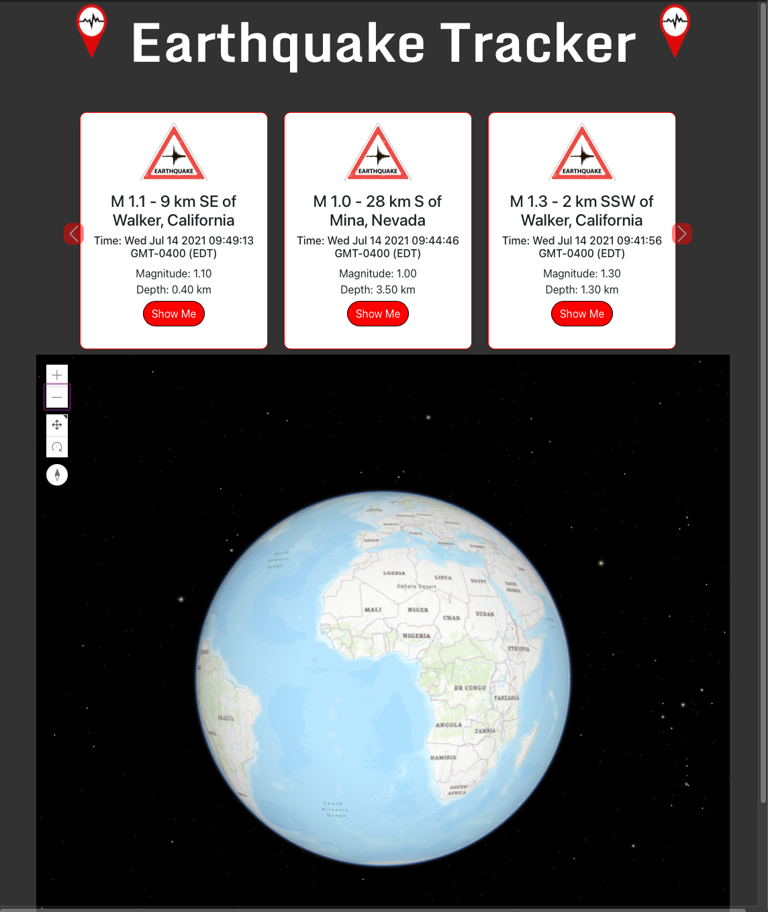
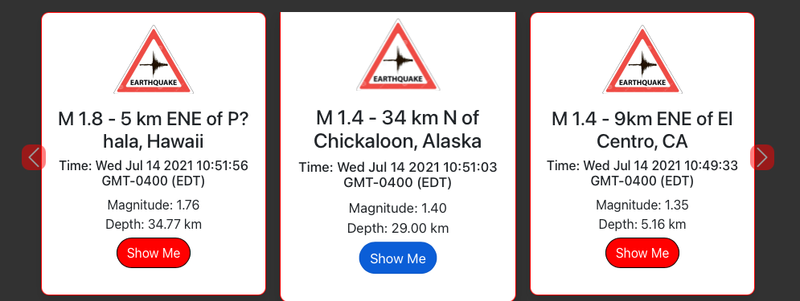
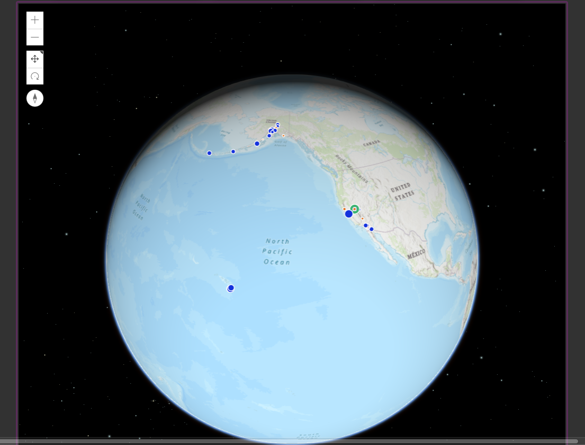

# Earthquake Tracker (EQ Tracker)

## Global Seismic Activity Tracking Application

Track seismic activity with the "Earthquake Tracker"! 
 
 

 
 
The most recent earthquakes from around the world are captured by the U.S. Geological Survey (USGS).  The USGS is the sole science agency for the Department of the Interior. It is sought out by thousands of partners and customers for its natural science expertise and its vast earth and biological data holdings. (https://www.usgs.gov/about/about-us)

Earthquake information is fetched via API from USGS and results are looped into a carousel of bootstrap cards that auto-scroll for the end-user.  To stop auto-scroll, hover the cursor on a result.  The card containing the result will pop out slightly and the auto-scroll will be paused.  Clicking the "Show Me" button attached to each card result will take the user to view the selected earthquake on the globe. 

"Previous" and "Next" arrows enable the end user to scroll back and forth through results without waiting on the auto-scroll timer.  
 
 

[EQ results, Prev/Next arrows, Show Me button hover effects]
 
 
__________
Esri's ArcGIS, a second API utilized for mapping, visualization and analysis, is fetched to display an interactive globe. (https://www.esri.com/en-us/arcgis/about-arcgis/overview) 

On the globe, the earthquake results fetched from USGS will be marked by a color-dot. 

These color-dots are size-scaled proportionally according to the magnitude of the earthquake and colored to denote the following:

DOT COLOR       MAGNITUDE of EQ

Blue            = 1 - 2.49  
Green           = 2.5 - 4.99  
Red             = > 5  

The selected earthquake (via the "Show Me" button) will be displayed with a teal circle around it to differentiate it from other displayed results.

_________

Navigating the Globe Window: Place cursor over globe, hold down left click button, then drag cursor in any direction to rotate the view in desired direction.  To zoom in, click the "-" button in the top left hand corner of the map windown.  To zoom out, click the "+" button 

While navigating the globe, any earthquake result marked by a color-dot can be clicked.  A popup window will appear to give pertinent information about the selected result. 

Refreshing the page will refresh results to the most recent 60 earthquakes worldwide.

Enjoy!

